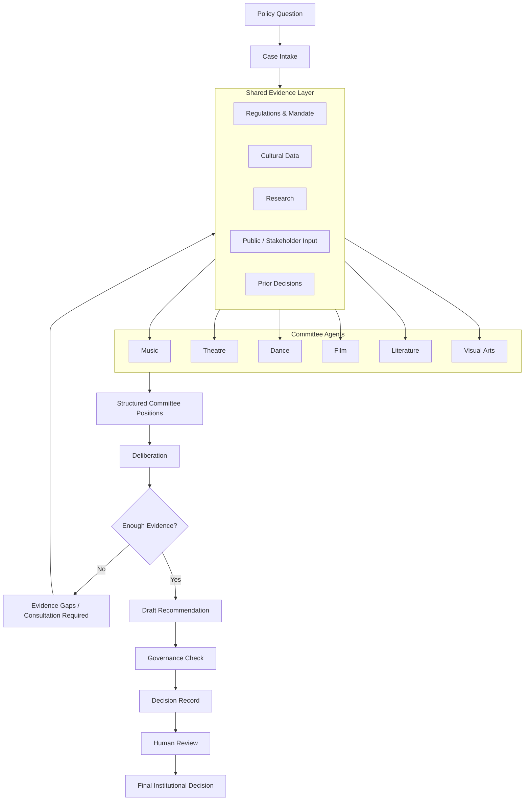

# Synthetic Arts Council — v0.1

Synthetic Arts Council is an open-source experiment exploring how AI agents can support evidence-based decision-making in arts councils and cultural institutions.

The initial reference implementation is inspired by the institutional structure and observed dynamics of Dewan Kesenian Jakarta (Jakarta Arts Council), but the framework is intended to be adaptable by arts councils and cultural institutions elsewhere in Indonesia.

This experiment does **not** attempt to replace artists, cultural representation, public consultation, or institutional authority. It asks a narrower question:

> Can discipline-specific AI committee members use shared evidence to deliberate on a cultural-policy question and produce a transparent, traceable recommendation?

The Jakarta reference case is useful because an institutional communication archive showed that activity and decisions were often visible while the final state of work was harder to reconstruct: among 72 selected episodes, discussion appeared in 71, decisions in 63, follow-up in 64, but clear closure in only 28. This finding is a project input and must remain linked to its underlying research record before external publication.

Synthetic Arts Council therefore treats **institutional memory and decision provenance as core infrastructure**, rather than documentation added afterward.

## What v0.1 needs to prove

> Given the same policy question and the same evidence, can six differently configured cultural-domain agents independently evaluate the issue and produce a transparent recommendation where evidence, interpretation, disagreement, uncertainty, and institutional state remain reconstructable afterward?

If yes, there is enough justification for v0.2. If no, the repository should document where the architecture fails rather than present the system as a finished governance product.

## Design principles

1. **Data before persona.** Committees differ through domain evidence, mandate, stakeholder perspective, and evaluation criteria—not fictional personalities.
2. **Evidence before recommendation.** Every substantive claim should be traceable to evidence.
3. **Interpretation is not fact.** The system keeps source, evidence, interpretation, committee position, deliberation, and recommendation distinct.
4. **Disagreement is useful data.** Committees may disagree, abstain, or request more evidence.
5. **Uncertainty remains visible.** Weak or missing evidence lowers confidence; models must not fill the gaps.
6. **Decisions require institutional state.** Each case moves through explicit states rather than disappearing after discussion.
7. **Human authority remains explicit.** The system provides decision support. It does not manufacture institutional authority or representation.

```text
SOURCE
  ↓
EVIDENCE
  ↓
INTERPRETATION
  ↓
COMMITTEE POSITION
  ↓
DELIBERATION
  ↓
RECOMMENDATION
```

## v0.1 architecture



The critical loop is **not enough evidence → back to evidence**. The system is not rewarded merely for reaching an answer.

## Data model

- A **source** is a complete document, dataset, submission, or record.
- **Evidence** is a specific claim, provision, excerpt, or data point extracted from a source, with context and limitations.
- A **case** contains the policy question, mandate, stakeholders, evidence references, and institutional state.
- A **committee position** separates cited evidence from interpretation and records concerns, gaps, confidence, and recommendation.
- **Deliberation** preserves agreement, disagreement, cross-disciplinary effects, missing evidence, missing stakeholders, and minority positions.
- A **decision record** preserves the recommendation and human-controlled institutional state.

The canonical example structures are in [`evidence/`](evidence/), [`cases/example-case/`](cases/example-case/), and [`outputs/`](outputs/).

Allowed committee positions are:

```text
SUPPORT
SUPPORT_WITH_CONDITIONS
OPPOSE
ABSTAIN
INSUFFICIENT_EVIDENCE
OUTSIDE_DOMAIN
```

`OUTSIDE_DOMAIN` prevents a committee from manufacturing an opinion merely because the orchestrator expects every committee to answer.

## Deliberation rules

1. Every committee receives the same case and shared evidence bundle.
2. Committees form their first positions independently; they do not see other initial positions.
3. The orchestrator compares structured fields rather than asking for a free-form consensus summary.
4. If evidence is insufficient, the case returns to evidence gathering or consultation.
5. Minority positions and unresolved gaps survive into the decision record.
6. Human review is required before any output can be treated as an institutional decision.

## Institutional states

```text
OPEN
  ↓
UNDER_REVIEW
  ↓
DELIBERATING
  ↓
RECOMMENDATION_READY
  ↓
HUMAN_REVIEW
  ↓
CLOSED / DEFERRED / REJECTED
```

## Repository structure

```text
synthetic-arts-council/
├── README.md
├── institution/
│   ├── institution.yaml
│   ├── mandate.md
│   └── decision-rules.yaml
├── committees/
│   ├── music.yaml
│   ├── theatre.yaml
│   ├── dance.yaml
│   ├── film.yaml
│   ├── literature.yaml
│   └── visual-arts.yaml
├── evidence/
│   ├── sources.yaml
│   └── evidence.yaml
├── evaluation/rubric.yaml
├── cases/
│   ├── example-case/case.yaml
│   └── ai-disclosure-pilot/
│       ├── README.md
│       ├── case.yaml
│       ├── sources.yaml
│       ├── evidence.yaml
│       └── templates/
├── outputs/
│   ├── .gitkeep
│   └── README.md
├── methodology/
│   ├── principles.md
│   └── limitations.md
├── scripts/validate.rb
└── LICENSE
```

## Forking for another institution

An institution should replace the files in `institution/` with its verified mandate and rules, then modify `committees/` to reflect its real cultural structure. The processing logic should not require modification.

> **The institution is configuration.**

## Current scope

v0.1 deliberately has no database, knowledge graph, authentication layer, frontend, or elaborate autonomous-agent framework. Ordinary YAML and JSON are sufficient until the experiment demonstrates a need for more infrastructure.

## Validate the contracts

The validator uses Ruby's standard library and requires no project dependencies:

```sh
ruby scripts/validate.rb
```

## Status and license

Status: **experimental specification scaffold; no institutional deployment or authority**.

Licensed under the [Apache License 2.0](LICENSE). Referencing an institution does not imply its endorsement, partnership, or authorization.
